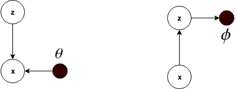
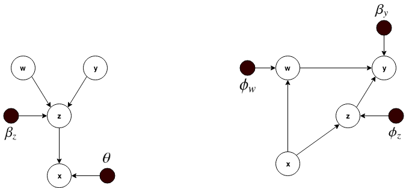

# VAE-GMVAE
This repository contains the implementation of the VAE and Gaussian Mixture VAE using TensorFlow. The VAE implementation  is completeley based on the model described in [link](https://arxiv.org/pdf/1606.05908.pdf) and the GMVAE implementation is based on the model presented in [link](https://arxiv.org/pdf/1611.02648.pdf) with some modifications in the optimization function and the implementation of some distributions. These modifications are described in the Chapter 4 of this bachelor thesis (not available yet).
  
## Dependencies
1. Install [Tensorflow](https://www.tensorflow.org/get_started/os_setup)
2. Install [Matplotlib](https://matplotlib.org/index.html)
3. Install [Numpy](http://www.numpy.org/)

## Graphical model


## Hyperparameters
The following hyperparameters are defined. Some of them handle the files
generated, others deal with saving and restoring a model and others determine certain aspects
of the algorithm.

Parameters to handle aspects of the training process and the neural networks:
```
  --model_name MODEL_NAME           Fixes the model and architecture
--dataset_name DATASET_NAME       MNIST or FREY
  --epochs EPOCHS                   Number of epochs for training
  --batch_size BATCH_SIZE           Number of inputs used for each iteration
  --sigma SIGMA                     Parameter that defines the variance of the output Gaussian distribution
  --learning_rate LEARNING_RATE     Parameter of the optimization function
  --z_dim Z_DIM                     Dimension of the latent variable z
  --w_dim W_DIM                     Dimension of the latent variable w. Only for GMVAE
  --K_clusters K_CLUSTERS           Number of modes of the latent variable z. Only for GMVAE
  --hidden_dim HIDDEN_DIM           Number of neurons of each dense layer
  --num_layers NUM_LAYERS           Number of dense layers in each network
```

Parameters to set  checkpoint, results, log and data directories:

```
  --checkpoint_dir CHECKPOINT_DIR   Directory name to save the checkpoints
  --result_dir RESULT_DIR           Directory name to save the generated images
  --log_dir LOG_DIR                 Directory name to save training logs
  --data_dir DATA_DIR               Directory for storing input data
```
Parameters used to enable/disable training, tensorboard summay, model load, plot and generation of results:
```
  --train TRAIN                     Flag to set train
  --summary SUMMARY                 Flag to set TensorBoard summary
  --restore RESTORE                 Flag to restore model
  --plot PLOT                       Flag to set plot
  --generate GENERATE               Flag to set generation
```
Other parameters:
```
  --save_step SAVE_STEP             Save network each X epochs
  --num_imgs NUM_IMGS               Images to plot
  --extra_name EXTRA_NAME           Extra name to identify the model
```
## Model selection
The selection of a model is done through the model_name parameter. It can take the following values:

-model1: VAE implemented using dense neural networks.
-model2: VAE implemented using CNNs
-model3: GMVAE (instability issues)
-model4_bias: GMVAE implemented using dense neural networks
-model5: GMVAE implemented using CNNs.

## Examples of use

## Results

## Acknowledgments
- C. Doersch, “Tutorial on Variational Autoencoders,” ArXiv e-prints, Jun. 2016. arXiv: <https://arxiv.org/pdf/1606.05908.pdf>
- N. Dilokthanakul et al., “Deep Unsupervised Clustering with Gaussian Mixture Variational Autoencoders,” ArXiv e-prints, Nov. 2016. arXiv: <https://arxiv.org/pdf/1611.02648.pdf>
